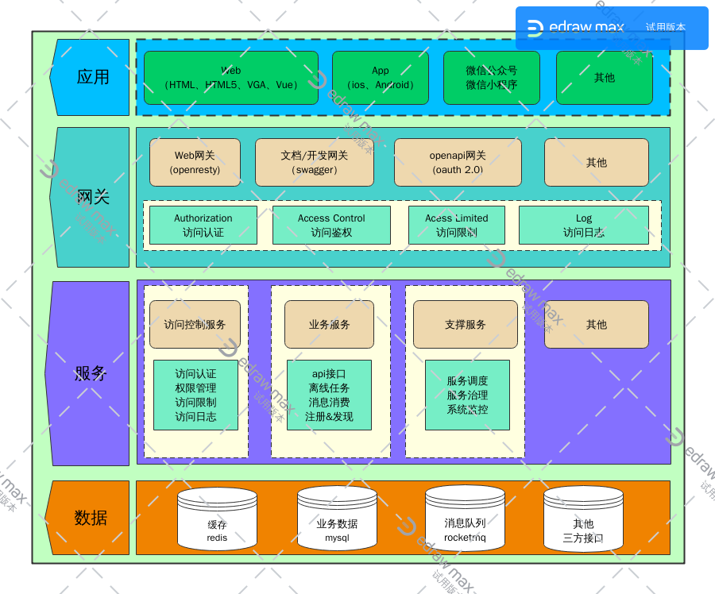

# web服务开发说明 #
后端技术的目的在于构建业务应用，采用实时或离线的方式来相应前端请求。

为了提高开发效率，方便模块化开发，同时较少不必要的重复工作，我们将应用分为了4层。

  * [应用层](#应用层)
  * [网关层](#网关层)
  * [服务层](#服务层)
  * [数据层](#数据层)



## 应用层 ##
将应用功能所需的请求与响应，通过用户与应用的交互来实现。方便用户使用应用的功能。

## 网关层 ##
对应用层请求服务接口进行控制，过滤，以及对请求内容不足的补充等。

* Web网关：用于web请求访问。采用openresty开发实现。
* 文档/开发网关：开发所需要查看的swagger文档服务,以及通过swagger页面访问的入口.
* openapi网关：用于开放接口支持三方调用,采用oauth 2.0方式

``` markdown
访问控制通常包含:
  * 访问认证：标识访问请求的用户
  * 访问限制：限制访问频次，或禁止访问
  * 访问授权：是否授权可以访问服务接口
  * 访问日志记录

补充请求内容:
  * 应用标识：请求发起的应用唯一标识
  * 访问标识：访问用户的唯一标识
  * 访问网关：访问请求的网关唯一标识
```

## 服务层 ##
目的在于实现处理应用请求的功能模块。

  * 支撑服务：支撑web服务运行相关的功能，比如服务调度，服务治理，服务监控等。
  * 业务服务：实现应用业务逻辑功能的程序模块
  * 访问控制：网管访问控制所使用的功能接口模块
  * 其他：为了方便接入一些三方接口，而可能产生的代理接口服务

### 服务调用请求补充内容 ###
在业务逻辑功能中，不同的服务之间时常需要互相调用来实现一定的业务逻辑．在他们相互调用时，请求内容需要补充添加一些内容．

``` markdown
补充请求内容:
  * 应用标识：请求发起的应用唯一标识
  * 访问标识：访问用户的唯一标识
  * 访问网关：访问请求的网关唯一标识
  * 请求服务：请求发起的服务唯一标识
```

## 数据层 ##
存储或记录应用功能产生数据的仓库。

  * 缓存：redis
  * 业务数据： mysql/pgsql/mssql/mongodb等
  * 消息队列：rocketmq
  * 其他三方接口
